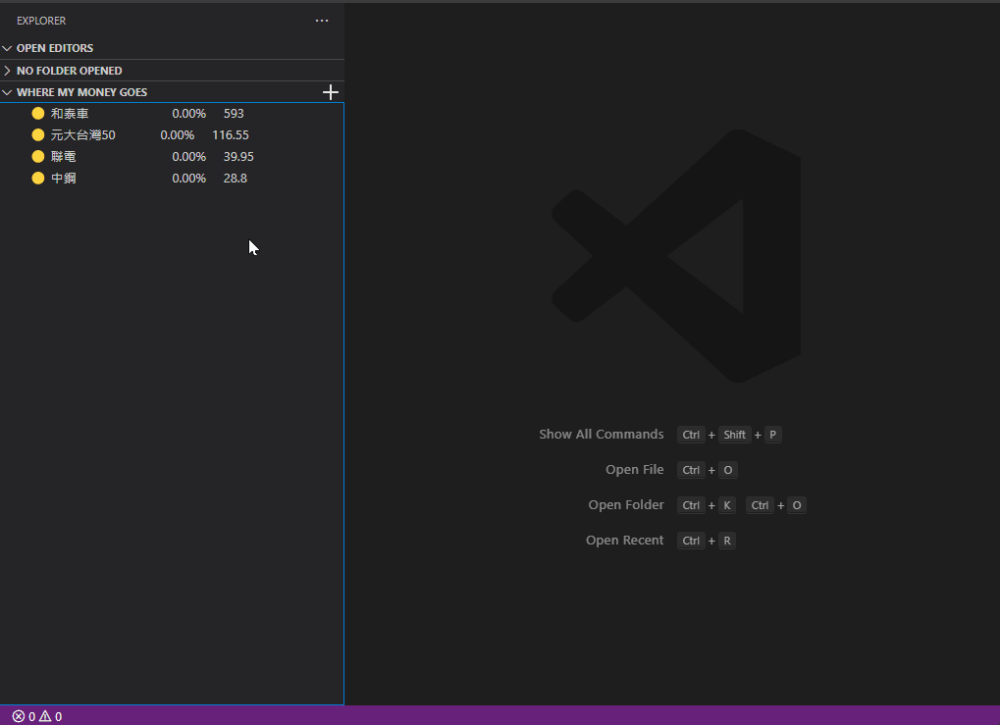

# TWSE - Taiwan stock monitor

認真 Coding 之餘撇一眼關心您的錢錢

## Usage

安裝之後在 Explorer 下方會出現 "WHERE MY MONEY GOES".

- 按 "+" 新增股票到 list 中，輸入時請輸入股票代號(例: 2609 或 2603)，新增多筆時請用半形空白隔開
  
- 要刪除時請對該股票按右鍵選 remove
  
- 將游標放到該檔股票上可查看詳細資訊
  

## 資料來源

[台灣證券交易所](https://mis.twse.com.tw/stock/index.jsp)

## 已知問題之臨時解決辦法

- 若安裝完成按"+"輸入完代號沒反應且 settings.json 內有出現剛剛輸入的代號，請按 F1 輸入 reload 選擇 reload window
- 若 watching list 內只有一筆資料且需要刪除它時，請至 settings.json 內將整個 twse-monitor.watchingList 刪除
